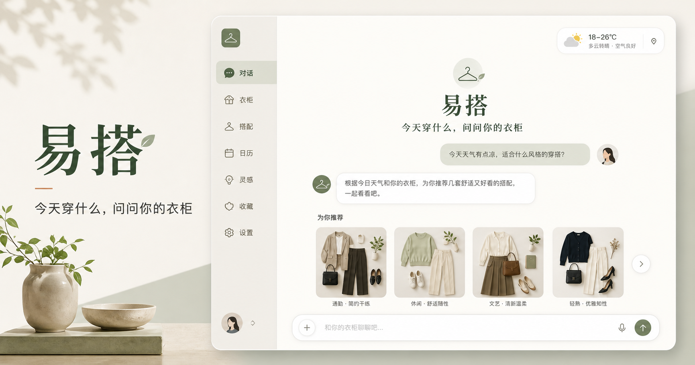
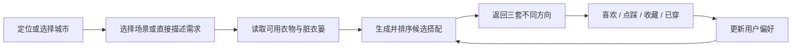

# 易搭 Yida v0.1

> 用你已经拥有的衣服，在几分钟内解决“今天穿什么”。



易搭是一款面向日常穿衣决策的 AI 衣柜与穿搭助手。产品结合天气、可用衣物、用户偏好和当天需求，从用户自己的衣柜中生成真正可以执行的搭配，而不是只让用户浏览更多穿搭内容。

当前仓库为产品 **v0.1 验证版本**，包含可运行的移动端 Web 原型、持久化衣柜、规则推荐、对话式需求输入，以及完整的产品和技术设计文档。

目前正在进入“第三阶段：真实衣柜”，已经加入真实照片上传、私有图片存储、AI 属性识别适配和 Seedream 展示图整理流程。

## 产品目标

易搭希望完成一个持续学习的闭环：

```text
衣柜数字化 → 生成今天可穿的搭配 → 用户采纳或反馈
      ↑                              ↓
      └──────── 越用越懂用户 ────────┘
```

核心价值不是“生成一张好看的穿搭图”，而是：

- 减少每天做穿衣决定的时间。
- 提高已有衣服的利用率。
- 根据天气和实际状态给出可执行推荐。
- 通过喜欢、点踩、收藏和“今天穿了”持续学习用户偏好。
- 在用户购买新衣服前，先判断现有衣柜是否已经有类似选择。

## v0.1 已实现

- 移动端优先的可点击产品界面。
- 用户风格偏好引导。
- 12 件基础单品组成的虚拟衣柜。
- 用户独立、可持久化的衣柜数据。
- 上衣、下装、外套和鞋子的组合推荐。
- 天气、场景、风格、保暖度和衣服可用状态评分。
- 上班、约会、休闲和运动场景快捷选择。
- 对话式穿搭需求输入。
- 对常见需求的规则理解：场景、冷热、正式程度、颜色和排除单品。
- 脏衣篓：放入后 3 天内不参与推荐。
- 喜欢、不感兴趣、收藏和“今天穿这套”反馈。
- 30 天穿搭历史的产品界面。
- 真实衣物照片上传与私有对象存储。
- 上传前自动压缩，支持 JPG、PNG 和 WebP。
- Seed 2.0 Lite 衣物属性识别适配：名称、类型、颜色、材质、图案、保暖度和场景。
- Seedream 5.0 Lite 展示图整理适配：去杂乱背景、平整展示并保留原图。
- AI 结果确认与手动修改后再加入衣柜。
- 13 类适用场景按工作学习、社交生活、日常出行分组多选，并在衣物卡片紧凑展示。
- 删除真实衣物时同步清理原图和 Seedream 展示图。
- 连衣裙可以独立与鞋子、外套组成推荐。
- 公开体验期每位访客每天最多识别 10 次，按北京时间每日重置。
- 模型未配置或调用失败时的安全回退。

## v0.1 尚未实现

- 真实定位与天气 API，目前界面使用模拟天气。
- 生产级自动抠图与颜色校正，目前 Seedream 只作为可选展示图整理。
- 线上环境的火山方舟密钥，目前仓库只包含接口适配，不包含任何密钥。
- 重复衣物识别和批量录入。
- 大模型驱动的自由对话。
- AI 模特和本人虚拟试穿。
- 抖音式个性化信息流模型。
- 生产级内容版权、审核和合规流程。

## 文档导航

| 文档 | 内容 |
|---|---|
| [产品定义](docs/product-overview.md) | 产品定位、核心价值、功能范围和北极星指标 |
| [目标用户](docs/target-users.md) | 目标市场、用户画像、需求和典型使用场景 |
| [最小 MVP](docs/mvp-spec.md) | MVP 范围、用户流程、推荐规则和验收标准 |
| [Agent 与 RAG](docs/agents-and-rag.md) | Agent 组成、职责边界、RAG 拆分和演进方案 |
| [技术架构](docs/technical-architecture.md) | 前后端、数据库、图片、推荐和 AI 服务架构 |
| [产品路线图](docs/roadmap.md) | 从 v0.1 到真实测试版的阶段规划 |
| [隐私与风险](docs/privacy-and-risks.md) | 身体照片、敏感信息、版权、生成内容与安全边界 |
| [版本记录](CHANGELOG.md) | 每个版本的主要变化 |

## 核心产品流程



## 本地运行

环境要求：Node.js `>=22.13.0`。

```bash
npm install
npm run dev
```

验证生产构建：

```bash
npm run build
```

数据库结构变化后生成迁移：

```bash
npm run db:generate
```

### 开启真实 AI 图片处理

1. 在火山方舟中国区（华北 2 / 北京）开通 `Doubao-Seed-2.0-lite` 和 `Doubao-Seedream-5.0-lite`。
2. 复制 `.env.example` 为 `.env.local`。
3. 只在 `ARK_API_KEY` 后填写密钥；不要提交 `.env.local`。
4. 重新启动本地服务。部署时把同名变量添加为服务端密钥。

默认调用地址为 `https://ark.cn-beijing.volces.com/api/v3`。这里使用两个模型是因为职责不同：Seed 2.0 Lite 输出衣物属性，Seedream 5.0 Lite 输出整理后的图片。生成图仅用于展示，识别始终基于用户原图。

## 当前技术栈

- React 19 + TypeScript
- vinext / Vite
- Cloudflare Worker 兼容运行时
- Cloudflare D1 + SQLite
- Cloudflare R2 私有图片存储
- Drizzle ORM
- OpenAI Sites 公开体验部署
- 火山方舟中国区模型适配

真实天气和大模型自由对话将在后续版本接入。

## 项目状态

`v0.1.0` 是产品概念与关键交互的验证版本，适合产品评审、早期用户访谈和下一阶段开发，不应直接作为面向公众的正式生产服务。

## 维护者

- 产品构想与产品负责人：仓库所有者
- 原型与技术协作：OpenAI Codex
