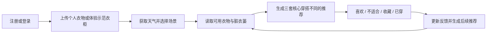

# 易搭 Yida v1.0

> 用你已经拥有的衣服，解决“明明衣服很多，但不知道今天怎么穿”。


易搭是一款以个人衣柜为核心的 AI 穿搭助手。它结合真实天气、使用场景、个人偏好、脏衣篓和当天的临时要求，从用户真正拥有且当前可用的衣服中生成可以直接执行的搭配。

## 在线体验

- 正式体验网站：[易搭 v1.0（火山引擎北京区）](https://s877em6sdkp7rquqv523o.apigateway-cn-beijing.volceapi.com/)
- GitHub 仓库：[1695974233-crypto/yida-v1.0](https://github.com/1695974233-crypto/yida-v1.0)

## v1.0 已实现

### 账号与数据

- 正式邮箱注册、验证邮件、登录和密码找回。
- 通过 Resend 自定义 SMTP 发送认证邮件。
- Google 与 GitHub OAuth 登录。
- Supabase Postgres、私有 Storage 和行级访问控制（RLS）；每位用户只能访问自己的数据。

### 个人衣柜

- 拍照或从相册批量上传真实衣物，上传前自动压缩。
- Seed 2.0 Lite 识别名称、类别、颜色、材质、图案、保暖度和适用场景。
- 用户确认或修改 AI 结果后再保存。
- 可选使用 Seedream 整理衣物展示图，同时保留原图。
- 支持衣物编辑、删除、脏衣篓和 13 类适用场景。
- 提供 16 件真实照片组成的固定示范衣柜；用户上传自己的衣物后，示范衣物自动隐藏且不参与私人推荐。

### 今日推荐

- 根据温度、体感、降雨、风速、场景、风格和衣物状态计算推荐。
- 支持主动定位和手动输入城市，定位失败不阻断使用。
- 推荐卡片直接展示对应衣物照片。
- 自动合并内容重复的衣物，避免重复推荐。
- 主推荐按核心穿搭去重：只更换鞋子视为同一套，不占用另一张主推荐卡片。
- “不适合我”会排除该核心组合；支持喜欢、收藏和“今天穿这套”。
- 支持“换一组”和对话式表达场景、冷暖、正式程度、颜色及不想穿的单品。

### AI 穿搭效果图

- 使用衣柜中的真实单品生成不露脸 AI 模特效果图。
- 用户自愿上传全身参考照后，可生成本人试穿示意。
- 放大效果图时使用完整适配比例，优先完整展示裤脚和鞋子。
- 对生成结果进行完整性检查，不合格时自动修复。

### 移动端体验

- 移动端优先的响应式界面。
- 支持手机浏览器定位授权与手动城市回退。
- 偏好和天气位置采用即时反馈与后台保存，减少等待感。

## 核心产品流程



## 本地运行

环境要求：Node.js `>=22.13.0`。

```bash
npm install
npm run dev
```

验证代码：

```bash
npm run lint
npm test
```

构建并部署到已关联的 veFaaS 应用：

```bash
npm run build:vefaas
vefaas deploy --region cn-beijing --yes
```

敏感密钥只应保存在 `.env.local` 和云端环境变量中，不应提交到 Git。

## 当前技术栈

- React 19 + TypeScript
- vinext / Vite
- 火山引擎 veFaaS（北京区）+ API 网关
- 火山方舟 Seed 2.0 Lite + Seedream 5.0 Lite
- Supabase Auth + Postgres + Storage + RLS
- Resend 自定义 SMTP
- Open-Meteo 天气与城市查询

## 文档导航

| 文档 | 内容 |
|---|---|
| [产品定义](docs/product-overview.md) | 产品定位、核心价值和功能范围 |
| [目标用户](docs/target-users.md) | 用户画像、需求和典型场景 |
| [MVP 规格](docs/mvp-spec.md) | 用户流程、推荐规则和验收标准 |
| [技术架构](docs/technical-architecture.md) | 前后端、数据、图片、推荐和 AI 服务架构 |
| [产品路线图](docs/roadmap.md) | 各阶段规划和完成状态 |
| [隐私与风险](docs/privacy-and-risks.md) | 照片、定位、生成内容和安全边界 |
| [veFaaS 部署说明](docs/vefaas-migration.md) | 北京区部署架构、发布方式和域名步骤 |
| [版本记录](CHANGELOG.md) | 版本的重要变化 |

## 当前边界

- 当前是可公开体验的 v1.0 产品版本，仍需持续进行推荐效果、并发、成本和安全监控。
- Supabase 项目目前位于美国区域，因此尚不是“全部数据境内存储”的最终合规架构。
- AI 识别和试穿存在模型误差，所有识别结果都允许用户确认和修改。
- 天气数据由 Open-Meteo 提供，服务异常时会降级为常规推荐。

## 维护者

- 产品构想与产品负责人：仓库所有者
- 原型与技术协作：OpenAI Codex
