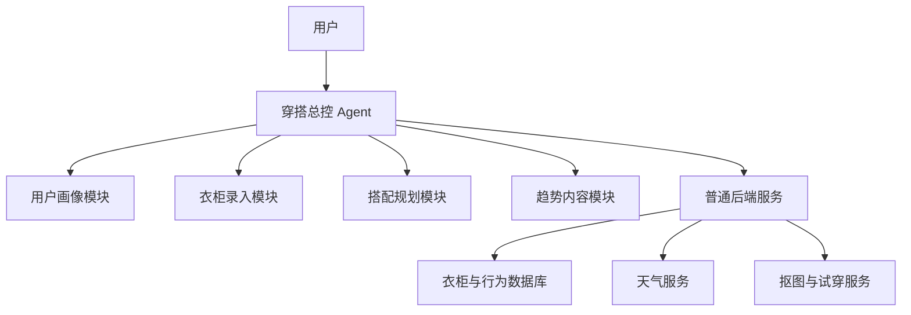

# Agent 与 RAG 设计

## v0.1 的实际方案

v0.1 没有部署复杂的多 Agent 系统。当前使用：

- 一个对话式入口。
- 一套确定性的自然语言规则解析。
- 一套衣物组合与评分程序。
- 数据库中的用户衣柜、偏好、会话和反馈。

这样可以先验证用户需求，并避免多 Agent 带来的延迟、成本和难以调试的问题。

## 推荐的演进架构

正式 AI 版本采用 **1 个总控 Agent + 4 个专门能力模块**。这些是逻辑职责，不一定需要五个独立模型进程。



## 1. 穿搭总控 Agent

职责：

- 理解用户当前意图。
- 区分长期偏好和当天临时要求。
- 决定查询天气、衣柜还是历史。
- 调用搭配规划和替换功能。
- 将结果组织成自然、简洁的回复。

示例输入：

> 明天要见客户，但不想太正式，上海有雨，也不想穿裙子。

总控需要转换成：

- 日期：明天。
- 场景：客户会面。
- 正式程度：轻商务。
- 天气：雨。
- 排除：裙装。

## 2. 用户画像模块

负责收集和更新：

- 风格偏好。
- 颜色偏好。
- 冷热敏感度。
- 紧身、宽松、露肤等接受范围。
- 常用场景。
- 用户明确给出的身体信息。
- 从反馈中计算的隐性偏好。

原则：不把单次拒绝过度解释为长期偏好，不对身体作贬义判断。

## 3. 衣柜录入模块

职责：

- 判断图片质量。
- 检测衣物主体。
- 调用抠图和图片优化服务。
- 生成结构化标签。
- 检测重复上传。
- 标记低置信度字段并让用户确认。

## 4. 搭配规划模块

职责：

- 读取天气、场景、偏好和硬性限制。
- 从个人衣柜召回可用单品。
- 根据搭配模板生成候选。
- 检查颜色、厚度、场景和重复穿着冲突。
- 排序并给出差异化的三套推荐。
- 支持“只换鞋”“更保暖”等局部修改。

## 5. 趋势内容模块

职责：

- 处理获得授权的穿搭内容。
- 提取风格、场景、季节、配色和搭配公式。
- 标记来源、授权和审核状态。
- 将趋势搭配转换为用户衣柜可复现的结构。

## 不应该做成 Agent 的能力

- 天气查询。
- 图片压缩。
- 数据库存取。
- 脏衣篓计时。
- 向量检索。
- 推荐排序模型。
- 虚拟试穿推理。
- 消息通知。

这些功能适合普通程序或专用模型服务，Agent 负责调用而不是代替它们。

## RAG 的作用

RAG 可以理解为“让 AI 回答前先拿到相关资料”，不等于重新训练模型。

易搭的 RAG 不应只建一个混合向量库，而应拆成四层。

### 1. 用户衣柜库

以结构化数据库为主：

- 品类、颜色、厚度、季节和状态。
- 是否在脏衣篓。
- 最近穿着时间。
- 图片位置。

硬性筛选使用 SQL，不依赖语义向量。

### 2. 穿搭知识库

按知识卡片组织：

- 场景规则。
- 配色关系。
- 版型关系。
- 叠穿和保暖方法。
- 搭配公式。
- 常见失败案例。

一个搭配公式或一条规则作为一个检索单元，而不是机械按字数切块。

### 3. 穿搭图片库

保存：

- 图片向量。
- 自动描述。
- 单品类别。
- 风格、场景和季节。
- 配色。
- 来源、版权和审核状态。

### 4. 用户行为库

行为日志先进入事件表，再汇总成偏好分数，不直接把所有点击记录塞进向量库。

## 推荐时的检索顺序

```text
理解用户需求
→ SQL 排除不可用衣服
→ 检索相关穿搭知识卡片
→ 检索相似风格和历史成功搭配
→ 生成候选组合
→ 规则校验
→ 个性化排序
→ 返回三套推荐和原因
```

## 什么时候需要机器学习

- 冷启动期：人工规则 + 热门模板。
- 有少量行为数据：规则评分 + 明确反馈权重。
- 有足够曝光和采纳数据：双塔召回、LightGBM 或其他排序模型。
- 长期：探索与利用算法，约 80% 已知偏好 + 20% 新风格探索。

在真实采纳数据不足前，不建议为了“看起来智能”而训练复杂模型。
