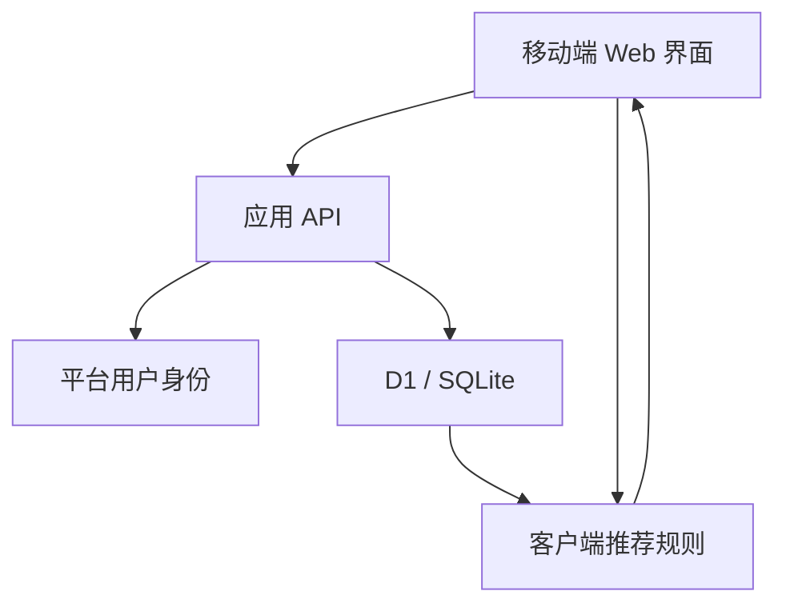
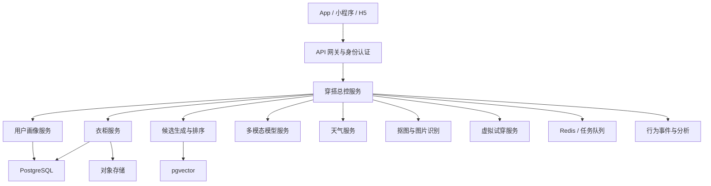

# 技术架构

## v0.1 架构



当前实现：

- 前端：React、TypeScript。
- 应用框架：vinext、Vite。
- 运行环境：Cloudflare Worker 兼容 ESM。
- 结构化数据：Cloudflare D1、SQLite、Drizzle ORM。
- 身份：私密站点提供的登录用户标识。
- 部署：OpenAI Sites。

## 目标生产架构



## 推荐技术选择

### 客户端

- 验证阶段：移动端 Web。
- 中国市场早期：微信小程序或跨端框架。
- 成熟阶段：Flutter、React Native 或原生 App。

### 后端

- TypeScript + NestJS，或 Python + FastAPI。
- 所有模型供应商放在统一适配层后，避免强绑定。
- 图片处理和试穿使用异步任务。

### 数据层

- PostgreSQL：用户、衣服、状态、搭配和反馈。
- pgvector：穿搭图片和知识向量。
- 对象存储：原图、抠图、缩略图和试穿图。
- Redis：缓存、限流和任务状态。
- 事件系统：曝光、点击、收藏和采纳。

## 数据模型

### 用户画像

- 用户标识。
- 风格偏好。
- 颜色偏好。
- 冷热敏感度。
- 常用场景。
- 用户主动提供的身体信息。
- 隐私授权状态。

### 衣物

- 衣物标识和用户归属。
- 品类与子品类。
- 主色和辅助色。
- 图案、材质、厚度和版型。
- 季节、正式程度、风格标签。
- 原图、抠图和缩略图地址。
- 是否虚拟单品。
- 脏衣篓结束时间。
- 最近穿着时间。

### 搭配与反馈

- 搭配包含的衣物。
- 生成时的天气和场景。
- 推荐得分和原因。
- 曝光、喜欢、点踩、收藏、替换和已穿。

### 对话

- 用户消息和助手消息。
- 当天有效的临时要求。
- 解析后的场景、冷暖、正式程度、颜色和排除条件。
- 与推荐结果的关联。

## 图片处理流程

```text
上传原图
→ 模糊、遮挡、多件衣物检查
→ 主体检测与分割
→ 背景透明化
→ 旋转、裁边、亮度和白平衡优化
→ 多模态模型识别属性
→ 用户确认低置信度字段
→ 保存原图、展示图、属性和向量
```

图片优化只能改善展示，不应改变衣服真实颜色、长度、图案或材质。

### 第三阶段模型分工

| 环节 | 当前实现 | 输出 |
|---|---|---|
| 原图保存 | Cloudflare R2 私有对象 | 原始照片位置 |
| 属性识别 | Seed 2.0 Lite 视觉理解 | 可编辑的衣物属性 JSON |
| 展示图整理 | Seedream 5.0 Lite 图生图 | 白底、居中的衣物展示图 |
| 最终确认 | 用户 | 被衣柜和推荐使用的真实属性 |

Seedream 5.0 Lite 的 API 输出是图片，不把它当作结构化识别模型。属性识别始终读取原图；Seedream 结果只影响衣柜卡片的展示。若整理图改变了衣物细节，用户仍可查看原图，后续版本需要加入原图/展示图对照和一键弃用展示图。

## 推荐服务边界

大模型负责：

- 理解自然语言。
- 从图片提取候选属性。
- 解释推荐。

确定性程序负责：

- 排除脏衣服。
- 温度和场景硬约束。
- 数据库存取。
- 候选组合。
- 排序、去重和多样性。

这能避免模型推荐用户不存在或当前不能穿的衣服。

## 可观测性

生产版本需要记录：

- 每次推荐使用的输入条件。
- 被召回和被过滤的衣服。
- 最终得分构成。
- 模型版本和提示词版本。
- 用户采纳与拒绝原因。
- 图片识别修正率。
- 失败、延迟和调用成本。
